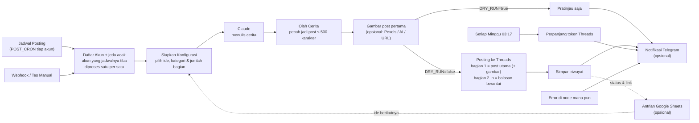

# AutoPostThreads

Sistem auto posting **cerita** ke **Threads** (Instagram) dengan **n8n** sebagai mesin otomasinya dan **Claude** (AI) sebagai penulis ceritanya.

Setiap jam yang kamu tentukan, n8n akan:

1. Memilih kategori cerita secara acak (misalnya horor kos, kisah lucu kantor, kisah inspiratif).
2. Menyuruh Claude menulis cerita utuh dalam bentuk **utas** (3–6 bagian, bisa diatur).
3. Memecah cerita supaya setiap post di bawah batas 500 karakter Threads.
4. Memposting bagian 1 sebagai post utama, lalu bagian berikutnya sebagai balasan berantai, persis seperti utas yang ditulis manual.
5. Mencatat judul cerita supaya ide berikutnya tidak berulang.

Fitur lain:

- **Jam posting bebas** lewat cron, plus **jeda acak** beberapa menit supaya tidak kelihatan seperti bot.
- **Mode uji (`DRY_RUN`)**: cerita dibuat tapi tidak diposting, untuk mengecek hasilnya dulu.
- **Webhook** untuk posting kapan saja dengan topik atau ide cerita tertentu.
- **Token Threads diperpanjang otomatis** setiap minggu (token berlaku 60 hari).
- Topik Threads (*topic tag*) dipilih AI atau ditentukan sendiri.
- **Banyak akun Threads** (opsional, sampai 10 akun): tiap akun bisa punya jadwal, kategori cerita, gaya bahasa, dan gambar sendiri. Kalau satu akun bermasalah, akun lain tetap jalan.
- **Gambar di post pertama** (opsional): foto stok dari Pexels yang cocok dengan cerita, ilustrasi AI, atau gambar milikmu sendiri.
- **Antrian Google Sheets** (opsional): tulis sendiri ide cerita (dan tanggal/jam posting) di Google Sheets; workflow mengambilnya satu per satu dan menulis status serta link post ke sheet.
- **Notifikasi Telegram** (opsional): kabar setiap utas terposting (dengan link), cerita mode uji untuk dibaca dari HP, dan peringatan kalau ada error.

## Cara kerja



Semua logika ada di satu workflow n8n: [`workflows/threads-autopost.json`](workflows/threads-autopost.json).

## Yang dibutuhkan

- [Docker](https://docs.docker.com/get-docker/) dan Docker Compose (Docker Desktop di Windows/Mac sudah termasuk).
- Akun Threads.
- Akun developer Meta (gratis) untuk akses Threads API.
- API key Claude dari [platform.claude.com](https://platform.claude.com) (berbayar sesuai pemakaian).
- Komputer/VPS yang **menyala terus**. Kalau n8n mati, jadwal posting ikut berhenti. Untuk posting 24 jam, pasang di VPS: ikuti **[Panduan Pasang di VPS](docs/PANDUAN-VPS.md)**.

## Langkah 1 — Siapkan akses Threads API

1. Buka [developers.facebook.com/apps](https://developers.facebook.com/apps) lalu klik **Create App**.
2. Pilih use case **Access the Threads API**, lalu selesaikan pembuatan app.
3. Buka **Use cases → Threads API → Customize → Permissions**, lalu pastikan izin berikut ditambahkan:
   - `threads_basic`
   - `threads_content_publish`
   - `threads_manage_replies` (untuk membalas post sendiri saat membuat utas)
4. Buka **App roles → Roles → Add People**, pilih **Threads Tester**, lalu masukkan username Threads kamu.
5. Terima undangannya dari aplikasi/web Threads: **Pengaturan → Akun → Izin situs web → Undangan → Terima**.
6. Kembali ke **Use cases → Threads API → Customize → Settings**, cari **User Token Generator**, lalu klik **Generate access token** untuk akun kamu. Salin tokennya.

App boleh tetap dalam mode *Development* karena yang diposting hanya akun kamu sendiri (akun tester).

> Token Threads ada dua jenis: *short-lived* (1 jam) dan *long-lived* (60 hari). Workflow butuh yang long-lived. Kalau token dari generator ternyata cuma berlaku 1 jam, tukar dengan perintah `tukar` di [Langkah 6](#langkah-6--cek-token-threads).

## Langkah 2 — Ambil API key Claude

Masuk ke [platform.claude.com](https://platform.claude.com), isi saldo/billing, lalu buat API key di menu **API Keys**.

## Langkah 3 — Isi file `.env`

```bash
git clone https://github.com/ReygaElkigia/AutoPostThreads.git
cd AutoPostThreads
cp .env.example .env
```

Buka `.env` dan isi minimal:

| Variabel | Isi |
| --- | --- |
| `THREADS_ACCESS_TOKEN` | Token dari Langkah 1 |
| `ANTHROPIC_API_KEY` | API key dari Langkah 2 |
| `WEBHOOK_SECRET` | Teks acak yang panjang, dipakai sebagai kata sandi webhook |

Biarkan `DRY_RUN=true` dulu untuk percobaan pertama.

## Langkah 4 — Jalankan n8n

```bash
docker compose up -d
```

Buka [http://localhost:5678](http://localhost:5678) dan buat akun owner n8n (akun lokal, hanya untuk login ke n8n kamu).

## Langkah 5 — Import dan aktifkan workflow

```bash
docker compose exec n8n n8n import:workflow --input=/workflows/threads-autopost.json
```

Lalu di n8n:

1. Buka workflow **Threads AutoPost - Cerita AI** (refresh halaman kalau belum muncul).
2. Klik **Publish** di kanan atas supaya jadwal dan webhook aktif.

## Langkah 6 — Cek token Threads

```bash
docker compose exec n8n node /scripts/threads-token.js cek
```

Kalau keluar nama akun Threads kamu, token sudah benar. Perintah lain:

```bash
# Tukar token short-lived (1 jam) jadi long-lived (60 hari). Isi THREADS_APP_SECRET di .env dulu
# (App settings → Basic → Threads App secret), lalu jalankan: docker compose up -d
docker compose exec n8n node /scripts/threads-token.js tukar TOKEN_SHORT_LIVED

# Perpanjang token secara manual (biasanya tidak perlu, workflow melakukannya tiap minggu)
docker compose exec n8n node /scripts/threads-token.js refresh
```

## Langkah 7 — Uji coba, lalu posting beneran

1. Di n8n, buka workflow lalu klik **Execute workflow**. Kalau diminta memilih trigger, pilih **Tes Manual**.
2. Buka node **Pratinjau (Dry Run)** untuk membaca cerita yang dibuat AI. Belum ada yang diposting. Kalau [notifikasi Telegram](#notifikasi-telegram-opsional) sudah diatur, ceritanya juga dikirim ke Telegram.
3. Kalau hasilnya sudah cocok, ubah `.env` menjadi `DRY_RUN=false`, lalu jalankan:

   ```bash
   docker compose up -d
   ```

Mulai saat itu, cerita akan diposting otomatis sesuai jadwal. Hasil setiap posting (termasuk link post-nya) bisa dilihat di menu **Executions** n8n.

## Mengatur jam posting

Jam posting diatur dengan `POST_CRON` di `.env` (format: `menit jam tanggal bulan hari`), mengikuti zona waktu `GENERIC_TIMEZONE` (default `Asia/Jakarta`).

| `POST_CRON` | Artinya |
| --- | --- |
| `0 7,12,19,21 * * *` | Setiap hari jam 07:00, 12:00, 19:00, 21:00 (default) |
| `30 8,20 * * *` | Setiap hari jam 08:30 dan 20:30 |
| `0 */3 * * *` | Setiap 3 jam |
| `0 19 * * 1-5` | Senin–Jumat jam 19:00 |
| `0 9,18 * * 6,0` | Sabtu dan Minggu jam 09:00 dan 18:00 |

`POST_JITTER_MINUTES=10` membuat posting terjadi acak 0–10 menit setelah jam tersebut. Isi `0` kalau mau tepat waktu.

Butuh jam dengan menit berbeda-beda (misalnya 07:15 dan 19:45)? Buka node **Jadwal Posting** di n8n, klik **Add Rule**, lalu tambahkan cron kedua.

Setelah mengubah `.env`, jalankan `docker compose up -d`. n8n akan dijalankan ulang dan langsung memakai jadwal baru.

## Mengatur gaya cerita

| Variabel | Fungsi |
| --- | --- |
| `STORY_NICHES` | Daftar kategori cerita, dipisah `\|`. Setiap posting memilih satu secara acak, tidak sama dengan posting sebelumnya. |
| `STORY_STYLE` | Gaya bahasa (aku-kamu, gue-lo, formal, dsb.). |
| `STORY_PERSONA` | Siapa naratornya, misalnya `karyawan swasta 27 tahun di Jakarta yang suka naik KRL`. |
| `STORY_EXTRA_INSTRUCTIONS` | Instruksi tambahan bebas untuk AI. |
| `STORY_MIN_PARTS` / `STORY_MAX_PARTS` | Jumlah bagian utas (maksimal 10). |
| `THREAD_NUMBERING` | `true` menambahkan `(1/5)`, `(2/5)`, ... di akhir setiap bagian. |
| `THREADS_TOPIC_TAG` | `auto` (dipilih AI), `off` (tanpa topik), atau topik tetap seperti `Cerita Horor`. |
| `AI_MODEL` | Model Claude. Default `claude-opus-5-5`. |
| `AI_EFFORT` | `low` / `medium` / `high` / `xhigh` / `max`. Makin tinggi makin teliti dan makin mahal. |

Aturan menulis yang lebih detail (hook, panjang per bagian, larangan hashtag, dsb.) ada di node **Susun Prompt** dan bisa diedit langsung di n8n.

**Perkiraan biaya AI:** dengan `claude-opus-5-5` dan effort `medium`, satu cerita sekitar US$0,03–0,07 (tergantung panjang). Untuk lebih hemat, coba `AI_MODEL=claude-sonnet-5-5` atau `claude-haiku-5-5`.

## Posting manual lewat webhook

Selama workflow sudah di-Publish, kamu bisa memicu posting kapan saja:

```bash
curl -X POST http://localhost:5678/webhook/threads-autopost \
  -H "x-webhook-secret: ISI_WEBHOOK_SECRET_KAMU" \
  -H "content-type: application/json" \
  -d '{"kategori": "kisah lucu di kantor", "ide": "salah kirim chat ke grup kantor", "jumlah_bagian": 4, "dry_run": true}'
```

Semua field di body opsional:

| Field | Fungsi |
| --- | --- |
| `kategori` | Kategori cerita. Kosong = acak dari `STORY_NICHES`. |
| `ide` | Ide cerita spesifik. |
| `jumlah_bagian` | Jumlah bagian utas (1–10). |
| `dry_run` | `true` = hanya dibuat, `false` = langsung diposting. Kosong = ikut `DRY_RUN` di `.env`. |
| `gambar` | URL gambar untuk post pertama. |
| `akun` | Nomor atau nama akun (lihat [Banyak akun Threads](#banyak-akun-threads-opsional)). Kosong = akun 1. |

Webhook langsung membalas `202` lalu bekerja di belakang. Hasilnya bisa dilihat di menu **Executions**. Bisa juga dipanggil dari aplikasi lain (Telegram bot, Google Sheets, shortcut HP, dsb.).

## Banyak akun Threads (opsional)

Satu n8n bisa mengelola sampai **10 akun Threads**. Pengaturan yang sudah ada di `.env` otomatis menjadi **akun 1**. Untuk menambah akun, isi token akun itu dengan awalan `AKUN_2_`, `AKUN_3_`, dan seterusnya:

```
AKUN_2_NAMA=Horor
AKUN_2_THREADS_ACCESS_TOKEN=token_akun_kedua
AKUN_2_POST_CRON="30 8,20 * * *"
AKUN_2_STORY_NICHES="cerita horor kos-kosan|misteri rumah tua"
```

Pengaturan berikut bisa dibedakan per akun dengan awalan yang sama. Yang tidak diisi ikut pengaturan utama:

| Pengaturan | Contoh |
| --- | --- |
| Identitas | `NAMA` (dipakai di notifikasi & webhook), `AKTIF` (`false` = akun dilewati tanpa menghapus pengaturannya) |
| Akun Threads | `THREADS_ACCESS_TOKEN`, `THREADS_USER_ID` (keduanya **tidak** ikut akun 1, supaya tidak salah posting ke akun lain) |
| Jadwal | `POST_CRON`, `DRY_RUN` |
| Cerita | `STORY_NICHES`, `STORY_STYLE`, `STORY_PERSONA`, `STORY_EXTRA_INSTRUCTIONS`, `STORY_MIN_PARTS`, `STORY_MAX_PARTS`, `THREAD_NUMBERING`, `THREADS_TOPIC_TAG` |
| AI & gambar | `AI_MODEL`, `AI_EFFORT`, `GAMBAR_SUMBER`, `GAMBAR_GAYA`, `GAMBAR_URLS`, `GAMBAR_KREDIT` |
| Lainnya | `ANTRIAN_KOSONG`, `TELEGRAM_CHAT_ID` (notifikasi akun ini dikirim ke chat lain) |

Setelah mengubah `.env`, jalankan `docker compose up -d`.

**Token tiap akun:** setiap akun Threads butuh token sendiri. Di app Meta yang sama, tambahkan akun itu sebagai **Threads Tester** (Langkah 1, poin 4–5), lalu buat tokennya lewat **User Token Generator**. Cek semua token sekaligus:

```bash
docker compose exec n8n node /scripts/threads-token.js cek semua
```

**Cara kerjanya:**

- Setiap jadwal tiba, workflow memilih akun yang `POST_CRON`-nya cocok dengan menit itu, lalu memproses akun-akun itu **satu per satu**. Kalau beberapa akun berjadwal sama, postingnya berurutan, berjarak sekitar 1–2 menit.
- Setiap akun diproses sebagai **sub-eksekusi** tersendiri, jadi di menu **Executions** setiap akun punya baris sendiri. Kalau satu akun gagal (misalnya tokennya kedaluwarsa), akun lain tetap diposting, dan Telegram mengirim `❌` lengkap dengan nama akunnya.
- Riwayat cerita dan token hasil perpanjangan disimpan terpisah per akun. Perpanjangan token mingguan berlaku untuk semua akun dan diringkas dalam satu pesan Telegram.
- **Webhook:** pilih akun dengan field `"akun": 2` atau `"akun": "Horor"`.
- **Antrian Google Sheets:** isi kolom `akun` dengan nomor atau nama akun supaya baris itu hanya diambil akun tersebut. Baris dengan kolom `akun` kosong boleh diambil akun mana saja.
- **Tes Manual** di n8n memproses akun `TES_AKUN` (default `1`).

## Gambar di post pertama (opsional)

Post pertama utas bisa diberi gambar supaya lebih menonjol di feed. Pilih sumbernya lewat `GAMBAR_SUMBER` di `.env`:

| `GAMBAR_SUMBER` | Gambar | Yang perlu disiapkan |
| --- | --- | --- |
| `off` (default) | Tanpa gambar | — |
| `pexels` | Foto stok asli yang cocok dengan suasana cerita. Claude menuliskan kata kuncinya, lalu workflow mencari di Pexels dan memotongnya portrait 1080×1350. | API key gratis dari [pexels.com/api](https://www.pexels.com/api/) → `PEXELS_API_KEY` |
| `ai` | Ilustrasi buatan AI. Claude menuliskan prompt-nya, gayanya diatur `GAMBAR_GAYA`. | Tidak ada (default memakai [Pollinations](https://pollinations.ai), gratis) |
| `url` | Acak dari daftar gambar milikmu (`GAMBAR_URLS`, dipisah `\|`), mengutamakan yang belum pernah dipakai. | URL gambar publik |

Gambar per postingan juga bisa ditentukan sendiri, apa pun `GAMBAR_SUMBER`-nya:

- **Antrian Google Sheets:** isi kolom `gambar` dengan URL gambar. Sheet yang dibuat sebelum fitur ini belum punya kolom itu; tambahkan saja kolom berjudul `gambar`.
- **Webhook:** kirim field `"gambar": "https://..."`.

**Syarat gambar dari Threads:** URL harus bisa dibuka publik tanpa login (link berbagi Google Drive tidak bisa), formatnya JPEG atau PNG, dan ukurannya maksimal 8 MB. Sebelum posting, workflow mengunduh gambarnya dulu untuk mengecek syarat ini.

**Kalau gambar gagal didapat** (Pexels tidak menemukan foto, generator AI sedang down, URL mati, format salah), utas **tetap diposting tanpa gambar**. Alasannya dikirim ke Telegram dan dicatat di kolom `catatan` antrian. Kalau gambar sudah terkirim tetapi ditolak Threads saat diproses, workflow berhenti dengan pesan error yang jelas.

Catatan:

- Foto Pexels gratis dipakai, termasuk untuk komersial. `GAMBAR_KREDIT=true` menambahkan `📷 Nama / Pexels` di post pertama sebagai apresiasi untuk fotografernya, selama masih muat di batas 500 karakter.
- Pollinations gratis tanpa key, tapi bisa lambat, kadang diberi watermark, dan dibatasi jumlah permintaannya. Kalau punya key Pollinations atau layanan gambar lain yang menghasilkan gambar langsung dari sebuah URL, ganti `GAMBAR_AI_URL` (`{prompt}` dan `{seed}` diganti otomatis).
- Post bergambar ditunggu `GAMBAR_JEDA_DETIK` (default 30 detik) sebelum dipublikasikan, sesuai saran Meta. Kalau gambarnya masih diproses, workflow mencoba lagi sampai 20 detik.

## Antrian dari Google Sheets (opsional)

Kalau ingin menentukan sendiri cerita apa yang diposting (dan kapan), tulis idenya di Google Sheets. Workflow mengambil baris berikutnya, membuat ceritanya, memposting, lalu menulis hasilnya kembali ke sheet.

Contoh isi sheet **Antrian**:

| tanggal | jam | akun | kategori | ide | jumlah_bagian | gambar | status | judul | link | catatan |
| --- | --- | --- | --- | --- | --- | --- | --- | --- | --- | --- |
| | | | kisah lucu di kantor | salah kirim chat curhat ke grup kantor | 4 | | terposting | Curhat nyasar ke grup kantor | https://www.threads.com/... | diposting 2026-10-08 19:03 |
| | | | | naik ojol nyasar ke kota sebelah | | https://contoh.com/ojol.jpg | | | | |
| 2026-10-10 | 19:00 | Horor | cerita horor kos-kosan | | 5 | | | | | |

| Kolom | Isi |
| --- | --- |
| `tanggal`, `jam` | Opsional. Format tanggal `2026-10-10` atau `10/10/2026`; jam `19:00`, `19.00`, atau `7:00 PM`. Mengikuti zona waktu `GENERIC_TIMEZONE`. |
| `akun` | Opsional, kalau memakai [banyak akun](#banyak-akun-threads-opsional). Nomor atau nama akun yang boleh mengambil baris ini. Kosong = akun mana saja. Sheet lama yang belum punya kolom ini tetap jalan. |
| `kategori`, `ide` | Isi minimal salah satu. Kalau cuma `ide`, AI menyesuaikan kategorinya sendiri. |
| `jumlah_bagian` | Opsional. Kosong = acak antara `STORY_MIN_PARTS` dan `STORY_MAX_PARTS`. |
| `gambar` | Opsional. URL gambar untuk post pertama (lihat [Gambar di post pertama](#gambar-di-post-pertama-opsional)). |
| `status` | Kosong = masih antre. Diisi otomatis: `diproses` → `terposting` atau `gagal`. Tulis apa saja (misalnya `tunda`) untuk melewati baris; kosongkan lagi untuk mengulang baris yang gagal. |
| `judul`, `link`, `catatan` | Diisi otomatis setelah posting (atau pesan error kalau gagal). |

Kolom lain boleh ditambahkan sesukamu; workflow tidak pernah mengubahnya.

### Dua mode antrian

| `ANTRIAN_MODE` | Cara kerja | `POST_CRON` yang cocok |
| --- | --- | --- |
| `urut` (default) | Setiap jam posting mengambil **satu baris teratas** yang statusnya kosong. Kalau `tanggal`/`jam` diisi, baris itu baru boleh diambil setelah waktunya lewat. | Jadwal biasa, misalnya `0 7,12,19,21 * * *` |
| `terjadwal` | Hanya baris yang punya `tanggal`/`jam`. Setiap baris diposting begitu waktunya tiba; baris tanpa waktu diabaikan. Kalau n8n sempat mati, baris yang terlewat diposting satu per satu mulai dari yang paling lama. | Sering, misalnya `*/10 * * * *` (posting telat paling lama 10 menit), dengan `POST_JITTER_MINUTES=0` |

Di mode `urut`, kalau antrian habis, `ANTRIAN_KOSONG=acak` (default) membuat AI memilih kategori sendiri dari `STORY_NICHES`. Isi `lewati` supaya tidak posting apa-apa sampai antrian diisi lagi.

Mode uji (`DRY_RUN`) memakai baris berikutnya untuk pratinjau tanpa mengubah statusnya. Webhook tanpa `kategori`/`ide` juga mengambil dari antrian, sedangkan webhook dengan `kategori`/`ide` tidak menyentuh antrian.

### Memasang antrian (sekali saja)

Tidak perlu akun Google Cloud. Penghubungnya adalah script kecil di dalam spreadsheet kamu sendiri ([`google-sheets/antrian.gs`](google-sheets/antrian.gs)).

1. Buat Google Sheets baru, lalu buka **Ekstensi → Apps Script**.
2. Hapus isi `Code.gs`, lalu tempel seluruh isi [`google-sheets/antrian.gs`](google-sheets/antrian.gs).
3. Ganti `GANTI-DENGAN-TEKS-ACAK` di baris `const SECRET = ...` dengan teks acak yang panjang, lalu simpan (Ctrl+S). Isi teks yang sama ke `GSHEET_SECRET` di `.env`.
4. Di toolbar Apps Script, pilih fungsi **siapkanSheet**, lalu klik **Jalankan**. Google akan meminta izin: pilih akunmu → **Lanjutan** → **Buka ... (tidak aman)** → **Izinkan**. Peringatan ini muncul karena script buatanmu sendiri belum diverifikasi Google. Script ini hanya bisa mengakses spreadsheet ini. Setelah selesai, sheet **Antrian** lengkap dengan contoh muncul.
5. Klik **Terapkan → Deployment baru**, pilih jenis **Aplikasi web**, lalu atur **Jalankan sebagai: Saya** dan **Yang memiliki akses: Siapa saja**. Klik **Terapkan**, lalu salin **URL aplikasi web** (berakhiran `/exec`) ke `GSHEET_URL` di `.env`.
6. Jalankan `docker compose up -d`.

Cek koneksinya dengan membuka `GSHEET_URL?secret=SECRET_KAMU&action=list` di browser. Kalau muncul teks berawalan `{"ok":true`, antrian sudah tersambung. Setelah itu jalankan **Tes Manual** dengan `DRY_RUN=true`: pratinjaunya akan menyebut "dari antrian baris ...".

Siapa pun yang tahu URL **dan** secret bisa membaca antrianmu, jadi simpan keduanya baik-baik. Kalau suatu saat isi script diubah, terapkan ulang lewat **Terapkan → Kelola deployment → ✏️ → Versi: Versi baru → Terapkan**. URL-nya tetap sama.

## Notifikasi Telegram (opsional)

Supaya tidak perlu membuka n8n setiap hari, workflow bisa mengirim kabar ke Telegram:

| Kejadian | Isi pesan |
| --- | --- |
| Utas berhasil diposting | Judul, kategori, jumlah bagian, link post, dan info gambar (atau alasan kalau tanpa gambar) |
| Mode uji (`DRY_RUN`) | Cerita lengkap dan link gambarnya, jadi bisa dibaca dan dinilai dari HP |
| Token diperpanjang (tiap Minggu) | Tanggal token berlaku sampai |
| **Error** di node mana pun | Nama node, pesan error, dan link ke eksekusi di n8n |

Cara mengaktifkan:

1. Di Telegram, buka [@BotFather](https://t.me/BotFather), kirim `/newbot`, ikuti petunjuknya, lalu salin token bot ke `TELEGRAM_BOT_TOKEN` di `.env`.
2. Buka bot barumu dan kirim `/start`. Kalau mau notifikasi masuk ke grup, tambahkan bot ke grup lalu kirim satu pesan di grup itu.
3. Cari chat ID:

   ```bash
   docker compose up -d
   docker compose exec n8n node /scripts/telegram.js chat-id
   ```

   Salin angka chat ID ke `TELEGRAM_CHAT_ID` di `.env` (chat ID grup diawali tanda minus), lalu jalankan `docker compose up -d` lagi.
4. Kirim pesan uji:

   ```bash
   docker compose exec n8n node /scripts/telegram.js tes
   ```

Mau dikabari kalau ada masalah saja? Isi `TELEGRAM_NOTIFY=error`. Untuk mematikan, isi `off` atau kosongkan `TELEGRAM_BOT_TOKEN`.

Kalau Telegram gagal dikirim (misalnya chat ID salah), posting ke Threads tetap jalan dan tetap dianggap berhasil. Link "Lihat di n8n" pada pesan error memakai `WEBHOOK_URL`. Di VPS dengan HTTPS ([cara B di panduan VPS](docs/PANDUAN-VPS.md#b-https-dengan-domain)), alamat ini diisi otomatis sehingga link-nya bisa dibuka dari HP.

## Token diperpanjang otomatis

Token long-lived Threads berlaku 60 hari. Setiap Minggu jam 03:17, workflow memperpanjang token dan menyimpan token baru di data internal workflow, jadi kamu tidak perlu mengganti `.env` tiap 2 bulan.

Kalau token sempat mati (misalnya n8n mati lebih dari 60 hari, atau password Threads diganti), buat token baru seperti di Langkah 1, isi ke `.env`, lalu `docker compose up -d`. Workflow otomatis memakai token baru dari `.env` itu. Untuk akun lain, isi ke `AKUN_n_THREADS_ACCESS_TOKEN` yang sesuai.

## Memperbarui workflow

Kalau ada versi baru `workflows/threads-autopost.json`, import ulang lalu klik **Publish** lagi (import ulang membuat workflow nonaktif):

```bash
git pull
docker compose exec n8n n8n import:workflow --input=/workflows/threads-autopost.json
```

Perubahan yang kamu buat sendiri di editor n8n akan tertimpa, jadi catat dulu kalau ada.

## Struktur folder

```
.
├── docker-compose.yml          # Menjalankan n8n via Docker
├── docker-compose.https.yml    # Tambahan HTTPS (Caddy) untuk VPS
├── Caddyfile                   # Pengaturan Caddy untuk HTTPS
├── .env.example                # Template pengaturan (salin jadi .env)
├── docs/
│   └── PANDUAN-VPS.md          # Panduan pasang di VPS
├── workflows/
│   └── threads-autopost.json   # Workflow n8n yang di-import
├── scripts/
│   ├── threads-token.js        # Alat bantu cek / tukar / refresh token Threads
│   └── telegram.js             # Alat bantu cari chat ID dan kirim pesan uji Telegram
└── google-sheets/
    └── antrian.gs              # Apps Script untuk antrian Google Sheets
```

## Masalah yang sering muncul

| Gejala | Solusi |
| --- | --- |
| `THREADS_ACCESS_TOKEN belum diisi` atau `ANTHROPIC_API_KEY belum diisi` | Isi `.env`, lalu `docker compose up -d` (bukan `restart`, karena `restart` tidak membaca ulang `.env`). |
| Error Threads `Session has expired` / kode 190 | Token kedaluwarsa. Buat token baru (Langkah 1) atau tukar ke long-lived (Langkah 6). |
| Error Threads soal *permission* | Pastikan `threads_content_publish` dan `threads_manage_replies` sudah ditambahkan dan undangan tester sudah diterima. |
| Error Threads yang menyebut user ID / `me` | Isi `THREADS_USER_ID` dengan angka User ID dari perintah `cek` (Langkah 6). |
| Claude error 401 | `ANTHROPIC_API_KEY` salah atau saldo habis. |
| Claude error 400 saat memakai model lama | Kosongkan `AI_EFFORT` dan isi `AI_FALLBACK=off`. |
| Tidak ada posting di jam yang ditentukan | Pastikan workflow sudah di-**Publish**, `DRY_RUN=false`, dan n8n/komputer menyala. Cek menu **Executions**. |
| Webhook membalas `401` | Header `x-webhook-secret` tidak sama dengan `WEBHOOK_SECRET` di `.env`. |
| `Antrian Google Sheets gagal dibaca: Secret salah ...` | `SECRET` di Apps Script tidak sama dengan `GSHEET_SECRET` di `.env`. |
| `... Sheet "Antrian" tidak ditemukan` | Jalankan fungsi `siapkanSheet`, atau ganti nama tab sheet jadi `Antrian`. |
| Antrian error dengan isi HTML atau kode 401/403 dari Google | Deployment belum diatur **Yang memiliki akses: Siapa saja**, atau `GSHEET_URL` bukan URL yang berakhiran `/exec`. |
| Baris antrian tidak pernah diambil | `status` harus kosong dan minimal `kategori` atau `ide` terisi. Cek format `tanggal`/`jam`: baris dengan format yang tidak dikenali dilewati dan disebut di pratinjau mode uji. Di mode `terjadwal`, baris wajib punya tanggal/jam. |
| Baris macet di status `diproses` | n8n mati di tengah proses. Kosongkan status baris itu supaya diambil lagi. |
| Telegram: `Tanpa gambar: ...` | Gambar gagal didapat, jadi utas diposting tanpa gambar. Baca alasannya. Untuk `pexels`, cek `PEXELS_API_KEY`; untuk `ai`, generator mungkin sedang sibuk dan biasanya pulih sendiri. |
| `Threads gagal memproses post (status ERROR ...)` | Threads tidak bisa mengambil gambarnya. Pastikan URL bisa dibuka publik dan berformat JPEG/PNG. |
| `❌ ... 👤 <nama akun>` di Telegram | Akun itu gagal, akun lain tetap jalan. Buka link di pesan untuk melihat detailnya. Paling sering karena token akun itu kedaluwarsa: cek dengan `threads-token.js cek semua`. |
| Webhook membalas `400` `Akun "..." tidak ditemukan` | Nomor/nama akun salah, akun itu belum punya `AKUN_n_THREADS_ACCESS_TOKEN`, atau `AKUN_n_AKTIF=false`. Pesannya menyebut daftar akun yang tersedia. |
| Akun tidak pernah posting sesuai jadwal | Cek `AKUN_n_POST_CRON` dan pastikan sudah `docker compose up -d` setelah mengubah `.env`. |
| Notifikasi Telegram tidak masuk | Jalankan `docker compose exec n8n node /scripts/telegram.js tes` untuk melihat pesan error-nya. Pastikan sudah mengirim `/start` ke bot. |

## Catatan

- Batas Threads API: 250 post dan 1.000 balasan per 24 jam per akun. Satu utas 5 bagian memakai 1 post + 4 balasan.
- Isi menu **Executions** n8n memuat token Threads (di output node *Siapkan Konfigurasi*). Jangan bagikan akses n8n ke orang lain, dan pakai HTTPS kalau n8n dibuka ke internet.
- n8n hanya bisa dibuka dari komputer tempat ia berjalan (`http://localhost:5678`). Untuk VPS, buka lewat SSH tunnel atau HTTPS seperti di [panduan VPS](docs/PANDUAN-VPS.md); jangan membuka port 5678 ke internet.
