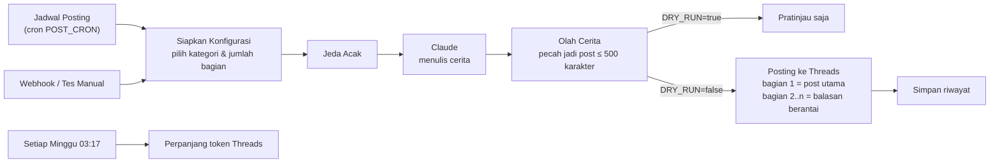

# AutoPostThreads

Sistem auto posting **cerita** ke **Threads** (Instagram) dengan **n8n** sebagai mesin otomasinya dan **Claude** (AI) sebagai penulis ceritanya.

Setiap jam yang kamu tentukan, n8n akan:

1. Memilih kategori cerita secara acak (misalnya horor kos, kisah lucu kantor, kisah inspiratif).
2. Menyuruh Claude menulis cerita utuh dalam bentuk **utas** (3–6 bagian, bisa diatur).
3. Memecah cerita supaya setiap post di bawah batas 500 karakter Threads.
4. Memposting bagian 1 sebagai post utama, lalu bagian berikutnya sebagai balasan berantai, persis seperti utas yang ditulis manual.
5. Mencatat judul cerita supaya ide berikutnya tidak berulang.

Fitur lain:

- **Jam posting bebas** lewat cron, plus **jeda acak** beberapa menit supaya tidak kelihatan seperti bot.
- **Mode uji (`DRY_RUN`)**: cerita dibuat tapi tidak diposting, untuk mengecek hasilnya dulu.
- **Webhook** untuk posting kapan saja dengan topik atau ide cerita tertentu.
- **Token Threads diperpanjang otomatis** setiap minggu (token berlaku 60 hari).
- Topik Threads (*topic tag*) dipilih AI atau ditentukan sendiri.

## Cara kerja



Semua logika ada di satu workflow n8n: [`workflows/threads-autopost.json`](workflows/threads-autopost.json).

## Yang dibutuhkan

- [Docker](https://docs.docker.com/get-docker/) dan Docker Compose (Docker Desktop di Windows/Mac sudah termasuk).
- Akun Threads.
- Akun developer Meta (gratis) untuk akses Threads API.
- API key Claude dari [platform.claude.com](https://platform.claude.com) (berbayar sesuai pemakaian).
- Komputer/VPS yang **menyala terus**. Kalau n8n mati, jadwal posting ikut berhenti. Untuk posting 24 jam, pasang di VPS.

## Langkah 1 — Siapkan akses Threads API

1. Buka [developers.facebook.com/apps](https://developers.facebook.com/apps) lalu klik **Create App**.
2. Pilih use case **Access the Threads API**, lalu selesaikan pembuatan app.
3. Buka **Use cases → Threads API → Customize → Permissions**, lalu pastikan izin berikut ditambahkan:
   - `threads_basic`
   - `threads_content_publish`
   - `threads_manage_replies` (untuk membalas post sendiri saat membuat utas)
4. Buka **App roles → Roles → Add People**, pilih **Threads Tester**, lalu masukkan username Threads kamu.
5. Terima undangannya dari aplikasi/web Threads: **Pengaturan → Akun → Izin situs web → Undangan → Terima**.
6. Kembali ke **Use cases → Threads API → Customize → Settings**, cari **User Token Generator**, lalu klik **Generate access token** untuk akun kamu. Salin tokennya.

App boleh tetap dalam mode *Development* karena yang diposting hanya akun kamu sendiri (akun tester).

> Token Threads ada dua jenis: *short-lived* (1 jam) dan *long-lived* (60 hari). Workflow butuh yang long-lived. Kalau token dari generator ternyata cuma berlaku 1 jam, tukar dengan perintah `tukar` di [Langkah 6](#langkah-6--cek-token-threads).

## Langkah 2 — Ambil API key Claude

Masuk ke [platform.claude.com](https://platform.claude.com), isi saldo/billing, lalu buat API key di menu **API Keys**.

## Langkah 3 — Isi file `.env`

```bash
git clone <url-repo-ini> AutoPostThreads
cd AutoPostThreads
cp .env.example .env
```

Buka `.env` dan isi minimal:

| Variabel | Isi |
| --- | --- |
| `THREADS_ACCESS_TOKEN` | Token dari Langkah 1 |
| `ANTHROPIC_API_KEY` | API key dari Langkah 2 |
| `WEBHOOK_SECRET` | Teks acak yang panjang, dipakai sebagai kata sandi webhook |

Biarkan `DRY_RUN=true` dulu untuk percobaan pertama.

## Langkah 4 — Jalankan n8n

```bash
docker compose up -d
```

Buka [http://localhost:5678](http://localhost:5678) dan buat akun owner n8n (akun lokal, hanya untuk login ke n8n kamu).

## Langkah 5 — Import dan aktifkan workflow

```bash
docker compose exec n8n n8n import:workflow --input=/workflows/threads-autopost.json
```

Lalu di n8n:

1. Buka workflow **Threads AutoPost - Cerita AI** (refresh halaman kalau belum muncul).
2. Klik **Publish** di kanan atas supaya jadwal dan webhook aktif.

## Langkah 6 — Cek token Threads

```bash
docker compose exec n8n node /scripts/threads-token.js cek
```

Kalau keluar nama akun Threads kamu, token sudah benar. Perintah lain:

```bash
# Tukar token short-lived (1 jam) jadi long-lived (60 hari). Isi THREADS_APP_SECRET di .env dulu
# (App settings → Basic → Threads App secret), lalu jalankan: docker compose up -d
docker compose exec n8n node /scripts/threads-token.js tukar TOKEN_SHORT_LIVED

# Perpanjang token secara manual (biasanya tidak perlu, workflow melakukannya tiap minggu)
docker compose exec n8n node /scripts/threads-token.js refresh
```

## Langkah 7 — Uji coba, lalu posting beneran

1. Di n8n, buka workflow lalu klik **Execute workflow**. Kalau diminta memilih trigger, pilih **Tes Manual**.
2. Buka node **Pratinjau (Dry Run)** untuk membaca cerita yang dibuat AI. Belum ada yang diposting.
3. Kalau hasilnya sudah cocok, ubah `.env` menjadi `DRY_RUN=false`, lalu jalankan:

   ```bash
   docker compose up -d
   ```

Mulai saat itu, cerita akan diposting otomatis sesuai jadwal. Hasil setiap posting (termasuk link post-nya) bisa dilihat di menu **Executions** n8n.

## Mengatur jam posting

Jam posting diatur dengan `POST_CRON` di `.env` (format: `menit jam tanggal bulan hari`), mengikuti zona waktu `GENERIC_TIMEZONE` (default `Asia/Jakarta`).

| `POST_CRON` | Artinya |
| --- | --- |
| `0 7,12,19,21 * * *` | Setiap hari jam 07:00, 12:00, 19:00, 21:00 (default) |
| `30 8,20 * * *` | Setiap hari jam 08:30 dan 20:30 |
| `0 */3 * * *` | Setiap 3 jam |
| `0 19 * * 1-5` | Senin–Jumat jam 19:00 |
| `0 9,18 * * 6,0` | Sabtu dan Minggu jam 09:00 dan 18:00 |

`POST_JITTER_MINUTES=10` membuat posting terjadi acak 0–10 menit setelah jam tersebut. Isi `0` kalau mau tepat waktu.

Butuh jam dengan menit berbeda-beda (misalnya 07:15 dan 19:45)? Buka node **Jadwal Posting** di n8n, klik **Add Rule**, lalu tambahkan cron kedua.

Setelah mengubah `.env`, jalankan `docker compose up -d`. n8n akan dijalankan ulang dan langsung memakai jadwal baru.

## Mengatur gaya cerita

| Variabel | Fungsi |
| --- | --- |
| `STORY_NICHES` | Daftar kategori cerita, dipisah `\|`. Setiap posting memilih satu secara acak, tidak sama dengan posting sebelumnya. |
| `STORY_STYLE` | Gaya bahasa (aku-kamu, gue-lo, formal, dsb.). |
| `STORY_PERSONA` | Siapa naratornya, misalnya `karyawan swasta 27 tahun di Jakarta yang suka naik KRL`. |
| `STORY_EXTRA_INSTRUCTIONS` | Instruksi tambahan bebas untuk AI. |
| `STORY_MIN_PARTS` / `STORY_MAX_PARTS` | Jumlah bagian utas (maksimal 10). |
| `THREAD_NUMBERING` | `true` menambahkan `(1/5)`, `(2/5)`, ... di akhir setiap bagian. |
| `THREADS_TOPIC_TAG` | `auto` (dipilih AI), `off` (tanpa topik), atau topik tetap seperti `Cerita Horor`. |
| `AI_MODEL` | Model Claude. Default `claude-opus-5-5`. |
| `AI_EFFORT` | `low` / `medium` / `high` / `xhigh` / `max`. Makin tinggi makin teliti dan makin mahal. |

Aturan menulis yang lebih detail (hook, panjang per bagian, larangan hashtag, dsb.) ada di node **Susun Prompt** dan bisa diedit langsung di n8n.

**Perkiraan biaya AI:** dengan `claude-opus-5-5` dan effort `medium`, satu cerita sekitar US$0,03–0,07 (tergantung panjang). Untuk lebih hemat, coba `AI_MODEL=claude-sonnet-5-5` atau `claude-haiku-5-5`.

## Posting manual lewat webhook

Selama workflow sudah di-Publish, kamu bisa memicu posting kapan saja:

```bash
curl -X POST http://localhost:5678/webhook/threads-autopost \
  -H "x-webhook-secret: ISI_WEBHOOK_SECRET_KAMU" \
  -H "content-type: application/json" \
  -d '{"kategori": "kisah lucu di kantor", "ide": "salah kirim chat ke grup kantor", "jumlah_bagian": 4, "dry_run": true}'
```

Semua field di body opsional:

| Field | Fungsi |
| --- | --- |
| `kategori` | Kategori cerita. Kosong = acak dari `STORY_NICHES`. |
| `ide` | Ide cerita spesifik. |
| `jumlah_bagian` | Jumlah bagian utas (1–10). |
| `dry_run` | `true` = hanya dibuat, `false` = langsung diposting. Kosong = ikut `DRY_RUN` di `.env`. |

Webhook langsung membalas `202` lalu bekerja di belakang. Hasilnya bisa dilihat di menu **Executions**. Bisa juga dipanggil dari aplikasi lain (Telegram bot, Google Sheets, shortcut HP, dsb.).

## Token diperpanjang otomatis

Token long-lived Threads berlaku 60 hari. Setiap Minggu jam 03:17, workflow memperpanjang token dan menyimpan token baru di data internal workflow, jadi kamu tidak perlu mengganti `.env` tiap 2 bulan.

Kalau token sempat mati (misalnya n8n mati lebih dari 60 hari, atau password Threads diganti), buat token baru seperti di Langkah 1, isi ke `.env`, lalu `docker compose up -d`. Workflow otomatis memakai token baru dari `.env` itu.

## Memperbarui workflow

Kalau ada versi baru `workflows/threads-autopost.json`, import ulang lalu klik **Publish** lagi (import ulang membuat workflow nonaktif):

```bash
git pull
docker compose exec n8n n8n import:workflow --input=/workflows/threads-autopost.json
```

Perubahan yang kamu buat sendiri di editor n8n akan tertimpa, jadi catat dulu kalau ada.

## Struktur folder

```
.
├── docker-compose.yml          # Menjalankan n8n via Docker
├── .env.example                # Template pengaturan (salin jadi .env)
├── workflows/
│   └── threads-autopost.json   # Workflow n8n yang di-import
└── scripts/
    └── threads-token.js        # Alat bantu cek / tukar / refresh token Threads
```

## Masalah yang sering muncul

| Gejala | Solusi |
| --- | --- |
| `THREADS_ACCESS_TOKEN belum diisi` atau `ANTHROPIC_API_KEY belum diisi` | Isi `.env`, lalu `docker compose up -d` (bukan `restart`, karena `restart` tidak membaca ulang `.env`). |
| Error Threads `Session has expired` / kode 190 | Token kedaluwarsa. Buat token baru (Langkah 1) atau tukar ke long-lived (Langkah 6). |
| Error Threads soal *permission* | Pastikan `threads_content_publish` dan `threads_manage_replies` sudah ditambahkan dan undangan tester sudah diterima. |
| Error Threads yang menyebut user ID / `me` | Isi `THREADS_USER_ID` dengan angka User ID dari perintah `cek` (Langkah 6). |
| Claude error 401 | `ANTHROPIC_API_KEY` salah atau saldo habis. |
| Claude error 400 saat memakai model lama | Kosongkan `AI_EFFORT` dan isi `AI_FALLBACK=off`. |
| Tidak ada posting di jam yang ditentukan | Pastikan workflow sudah di-**Publish**, `DRY_RUN=false`, dan n8n/komputer menyala. Cek menu **Executions**. |
| Webhook membalas `401` | Header `x-webhook-secret` tidak sama dengan `WEBHOOK_SECRET` di `.env`. |

## Catatan

- Batas Threads API: 250 post dan 1.000 balasan per 24 jam per akun. Satu utas 5 bagian memakai 1 post + 4 balasan.
- Isi menu **Executions** n8n memuat token Threads (di output node *Siapkan Konfigurasi*). Jangan bagikan akses n8n ke orang lain, dan pakai HTTPS kalau n8n dibuka ke internet.
- Kalau n8n dipasang di VPS dengan domain, isi `WEBHOOK_URL` dengan URL publiknya dan ubah `N8N_SECURE_COOKIE=true` setelah HTTPS aktif.
